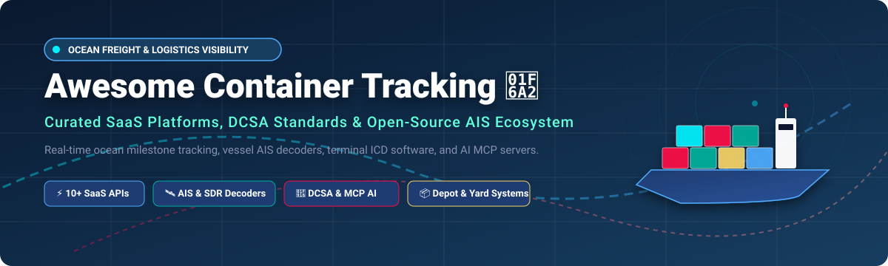

# Awesome Container Tracking 🚢

  

  
  
  
  
  
  
  

## 🌊 Top Container Tracking Platforms & Open-Source Ecosystem

**Curated List of SaaS Products & Open-Source GitHub Projects**

*Focused on Ocean Freight Visibility, Container Milestone Tracking, AIS Vessel Tracking, Port Congestion & Demurrage Management*

**Last updated: September 2026** 📅

---

### 🌐 SEO & Market Overview

The **global container tracking and supply chain visibility market** is estimated at **$3.8 Billion to $4.5 Billion**, projecting strong CAGR (>16%) driven by global trade digitization, DCSA standardization, and predictive logistics requirements. 

> 💡 **Market Dynamics**: The sector is **moderately fragmented**. While enterprise giants (project44, Descartes) command major logistics contracts, ocean freight visibility is not a winner-take-all market. Specialized API providers (Vizion, Terminal49), niche maritime analytics tools (Portcast, ShipsGo), and localized depot/terminal management platforms coexist alongside open-source AIS receivers and AI Model Context Protocol (MCP) servers.

---

This repository tracks notable **SaaS platforms** and **open-source projects** for **Container Tracking**. These tools help shippers, freight forwarders, ocean carriers, third-party logistics (3PL) providers, and port terminal operators monitor container movements, receive DCSA milestone alerts, predict ETAs, and manage demurrage and detention risk.

---

## 📑 Table of Contents

- [🏢 SaaS/Hosted Platforms](#-saashosted-platforms)
- [🔓 Open-Source GitHub Projects](#-open-source-github-projects)
- [🤝 How to Contribute](#-how-to-contribute)
- [⚠️ Disclaimer](#️-disclaimer)
- [💖 Support & Community](#-support--community)
- [📈 Star History](#-star-history)

---

## 🏢 SaaS/Hosted Platforms

> **SaaS & Enterprise Visibility Providers** ranked by company scale (Estimated Valuation / Annual Revenue descending):

| Company / SaaS Platform 🏢 | Valuation / Revenue Scale 💰 | Pricing / Starting Tier 🏷️ | Free Tier / Trial Limits 🎁 | Key Container Tracking Features & DCSA Integration 🚢 |
| :--- | :--- | :--- | :--- | :--- |
| **[Descartes](https://www.descartes.com/)** 🏬 | **~$7.5 Billion** valuation (Public NASDAQ: DSGX) | Starts at ~$250/month (Global Logistics Network tier) | No free tier; 14-day enterprise trial upon request | Global trade intelligence, ocean container tracking, customs compliance, and multi-modal fleet monitoring. |
| **[project44](https://www.project44.com/)** 🚀 | **~$2.4 Billion** valuation ($160M+ ARR) | Starts at ~$1,000/month (Visibility Starter tier) | 14-day interactive demo/sandbox trial for qualified logistics enterprises | End-to-end multi-modal visibility (Ocean, Air, Rail, Road), predictive ETAs, port congestion, and demurrage risk management. |
| **[CargoSmart](https://www.cargosmart.com/)** 🚢 | **~$500 Million** valuation (Subsidiary of GSBN/OOCL) | Starts at ~$500/month (Enterprise Logistics Plan) | 30-day corporate demo sandbox trial | Ocean shipping visibility platform, carrier milestone notifications, port congestion data, and disruption management. |
| **[Ocean Insights](https://www.ocean-insights.com/)** ⚓ | **~$100 Million** valuation (Acquired by project44) | Starts at ~$450/month (Container Track & Trace tier) | 14-day free trial with tracking limit up to 10 container B/Ls | Ocean freight track & trace, container milestone alerts, carrier performance benchmarks, and port delay analytics. |
| **[Vizion](https://www.vizionapi.com/)** ⚡ | **~$80 Million** valuation ($15M+ ARR) | Starts at $0.50 per container tracked ($50/mo minimum) | Free Tier: First 50 containers tracked free forever upon signup | Normalized container tracking API connected to 100+ ocean carriers, real-time DCSA milestone pushes, and detention/demurrage alerts. |
| **[Terminal49](https://terminal49.com/)** 🏗️ | **~$45 Million** valuation ($8M+ ARR) | Starts at $1.00 per container tracked ($99/mo minimum) | 14-day free trial with 25 test containers included | Ocean container tracking & US port terminal visibility API, chassis tracking, demurrage risk alerts, and gate-out status. |
| **[GoComet](https://www.gocomet.com/)** 🌐 | **~$35 Million** valuation ($6M+ ARR) | Starts at ~$299/month (Basic Tracking Plan) | 14-day free trial with up to 15 container tracking lookups | Multi-carrier ocean container tracking, automated freight rate procurement, invoice audit, and ETA delay alerts. |
| **[Portcast](https://www.portcast.io/)** 🔮 | **~$20 Million** valuation ($3M+ ARR) | Starts at ~$199/month (Developer API Plan) | 14-day free trial with 20 container API tracking requests | AI-driven ocean container tracking, predictive ETA machine learning algorithms, vessel delay forecasts, and port congestion indices. |
| **[ShipsGo](https://shipsgo.com/)** 📦 | **~$15 Million** valuation ($2.5M+ ARR) | Starts at $1.50 per credits package (pay-as-you-go) | Free Tier: 5 container tracking credits free forever upon account creation | Container tracking across 200+ ocean carriers, live map tracking visualization, milestone notifications, and carrier performance reports. |
| **[SeaRates](https://www.searates.com/)** 🌊 | **~$12 Million** valuation (DP World Logistics) | Starts at $25/month (Container Tracking Web Widget) | Free Tier: 3 free container tracking lookups per month on basic account | Ocean freight container tracking web widget & API, rate calculator, route planner, and bill of lading lookup. |

---

## 🔓 Open-Source GitHub Projects

> **Open-Source Container & Vessel Tracking Solutions** sorted by GitHub_Stars ⭐ (descending):

| Open-Source Project 🛠️ | GitHub_Stars ⭐ | Primary Tech Stack 💻 | Domain & Core Capabilities 🎯 |
| :--- | :--- | :--- | :--- |
| **[AIS-catcher](https://github.com/jvde-github/AIS-catcher)** 📻 |  | C++ | Dual-channel AIS receiver for RTL-SDR, Airspy, HackRF, SDRplay, and SoapySDR. Decodes AIVDM/AIVDO signals from vessels for container ship tracking pipelines. |
| **[libais](https://github.com/schwehr/libais)** 📚 |  | C++ / Python | Production-grade C++ decoder with Python bindings for Automatic Identification System (AIS) NMEA data payloads. |
| **[pyais](https://github.com/M0r13n/pyais)** 🐍 |  | Python | Full-featured Python library for decoding and encoding AIS messages (AIVDM/AIVDO) with TCP, UDP, and file stream support. |
| **[Ais.Net](https://github.com/ais-dotnet/Ais.Net)** ⚡ |  | C# / .NET | High-performance, zero-allocation .NET AIS decoder capable of processing millions of NMEA sentences per second. |
| **[rpi_boat_utils](https://github.com/itemir/rpi_boat_utils)** ⛵ |  | Shell / Python | Raspberry Pi marine utilities, UART control scripts, AIS wireless daemon, and Signal K integration for vessel position tracking. |
| **[AISdb](https://github.com/AISViz/AISdb)** 🗄️ |  | Python / SQLite / Rust | Smart database utilities for storing, querying, and trajectory-indexing massive time-series AIS vessel tracking streams. |
| **[noaadata](https://github.com/schwehr/noaadata)** 🌊 |  | Python | Pure Python AIS message decoder and encoder utilities maintained by coastal oceanography researchers. |
| **[ais-decoder](https://github.com/aduvenhage/ais-decoder)** 🛠️ |  | C++ / Python | Lightweight C++ AIS NMEA sentence parser and decoder with Python bindings for maritime container tracking integrations. |
| **[aisdecode](https://github.com/madpsy/aisdecode)** 📡 |  | Go | AIS decoder and web-based vessel tracker for serial hardware and UDP NMEA streams with built-in map UI and aggregator mode. |
| **[AISight](https://github.com/snekkenull/AISight)** 🗺️ |  | Node.js / React / TimescaleDB | Full-stack real-time vessel tracking web application with live AIS data streaming from AISStream API, Mapbox interactive map, and REST endpoints. |
| **[Container Tracking MCP](https://github.com/lxxmng/container-tracking-mcp)** 🤖 |  | TypeScript / Model Context Protocol | Ocean-freight MCP server exposing container tracking for 225+ shipping lines to Claude, Cursor, and ChatGPT normalized to DCSA standards. |
| **[marine-traffic-mcp](https://github.com/salmangada/marine-traffic-mcp)** 🧭 |  | Go / MCP | Model Context Protocol server connecting AI assistants directly to MarineTraffic API for vessel MMSI/IMO lookup, port calls, and port details. |
| **[ICD TZ](https://github.com/navariltd/icd_tz)** 🏬 |  | Python / Frappe Framework | Comprehensive Inland Container Depot (ICD) Management application featuring gate-in/gate-out seal verification, yard location tracking, automated tariff billing, and payment security. |

---

### 🧩 System Integration Reference

**Architecture Blueprint for Building Custom Container Visibility Systems**:

1. **AIS Data Ingestion & Signal Decoding**: Deploy **[AIS-catcher](https://github.com/jvde-github/AIS-catcher)** or **[pyais](https://github.com/M0r13n/pyais)** to receive and decode raw AIVDM maritime signals from hardware SDRs or UDP feeds.
2. **Spatial Data Warehouse**: Index time-series vessel positions using **[AISdb](https://github.com/AISViz/AISdb)** backed by PostgreSQL + TimescaleDB.
3. **Carrier Milestone Standardization**: Integrate DCSA-compliant ocean tracking events using **[Container Tracking MCP](https://github.com/lxxmng/container-tracking-mcp)** or commercial APIs like **[Vizion](https://www.vizionapi.com/)** and **[Terminal49](https://terminal49.com/)**.
4. **Terminal & Depot Yard Management**: Manage inland container lifecycle, gate-in payments, and yard bay storage via **[ICD TZ](https://github.com/navariltd/icd_tz)**.

---

## 🤝 How to Contribute

Contributions are welcome! Please follow these simple guidelines:

1. Fork this repository 🍴.
2. Add or edit entries in `README.md` following the table formatting.
3. Include: Name, website link, Stars_Count (if open-source), pricing/valuation details, and concise descriptions.
4. Submit a Pull Request (PR) with a brief summary of additions.

---

## ⚠️ Disclaimer

- This repository is a **community-curated list** for informational and educational purposes.
- Container tracking platforms process proprietary operational data; ensure your integrations comply with relevant data privacy laws and commercial shipping terms.
- Commercial APIs (Vizion, project44, Terminal49) provide direct carrier EDI/API connections and SLA-backed SLAs, whereas open-source projects excel at AIS signal decoding, vessel spatial analytics, and inland depot operations.

---

## 💖 Support & Community

Thank you for visiting **Awesome Container Tracking**! 🚢 If this repository has helped you build logistics applications, track shipments, or research maritime technology:

- ⭐ **Star this repository** to show your support!
- 🔀 **Fork it** to contribute new tools and frameworks.
- 📢 **Share it** with your logistics engineering colleagues and supply chain networks.
- ☕ **Buy me a coffee / Sponsor**: If you'd like to support ongoing maintenance of this awesome list, consider sponsoring on [GitHub Sponsors](https://github.com/sponsors/ishandutta2007).

---

## 📈 Star History

---

  <i>Made with ❤️ for logistics engineers, freight forwarders, supply chain developers, and port operations managers.</i>

